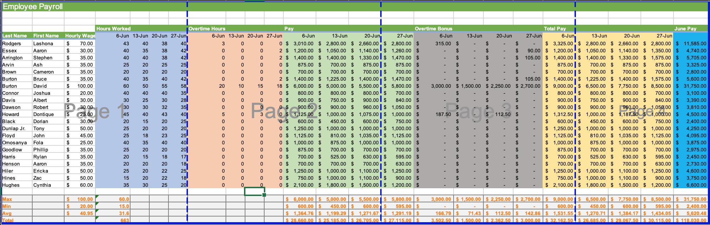
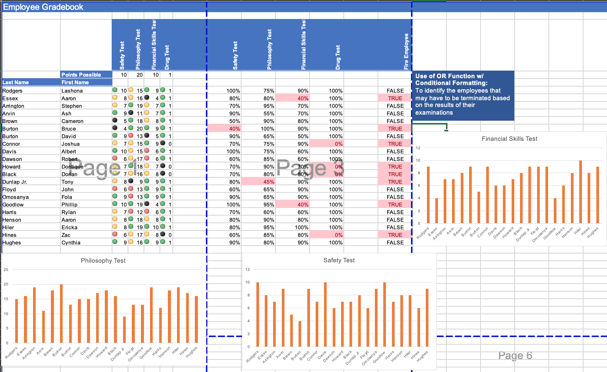
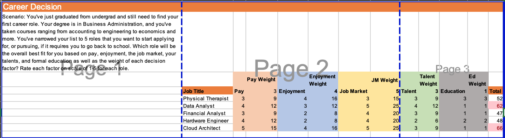
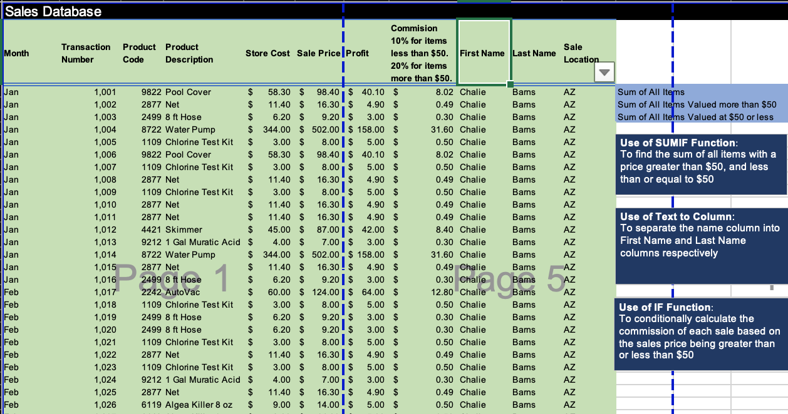
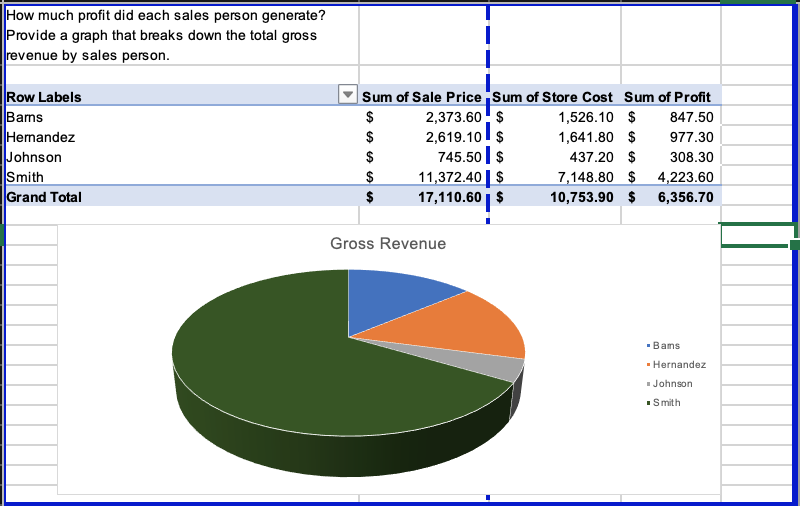
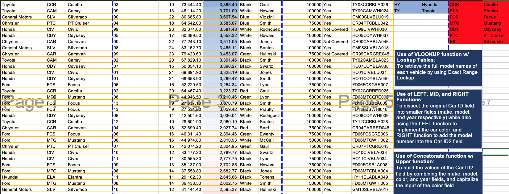
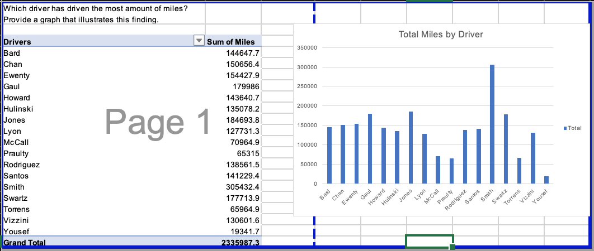
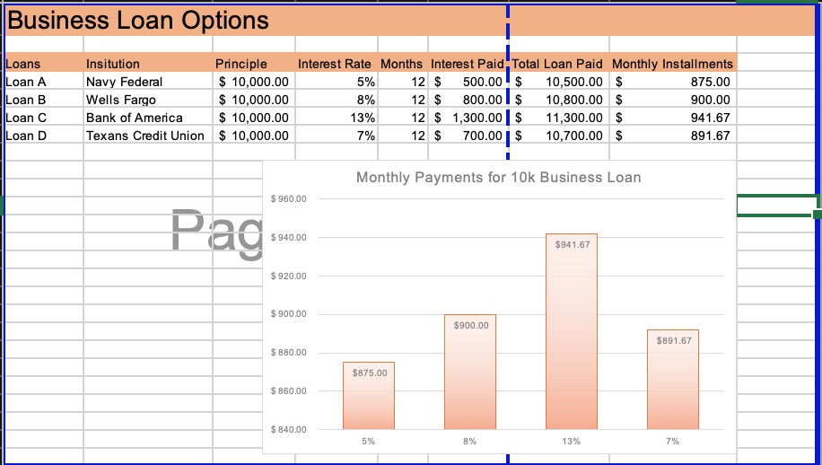

# Data Analysis & Visualization Portfolio Projects
## The following are my projects in Excel, SQL, and PowerBI:  
#### *Feel free to connect with me on Linkedin : [Dazon Worthey](https://www.linkedin.com/in/dazonw/)*  

- [x] **Excel** - 

*Kindly download these Excel files from this repository and view them in Microsoft Excel.*

- Employee Roster: Employee Payroll Worksheet: Relative vs. Absolute References, MIN, MAX, AVG, SUM  

- Employee Examination Gradebook: OR, Conditional Formatting  

- Weighted Career Decisions  

- Sales Database: IF, SUMIF, Text-to-Column, Pivot Table

- Car Inventory Database: Lookup Table, VLOOKUP, LEFT, MID, RIGHT, CONCATONATE, UPPER

- 10K Business Loan Options

